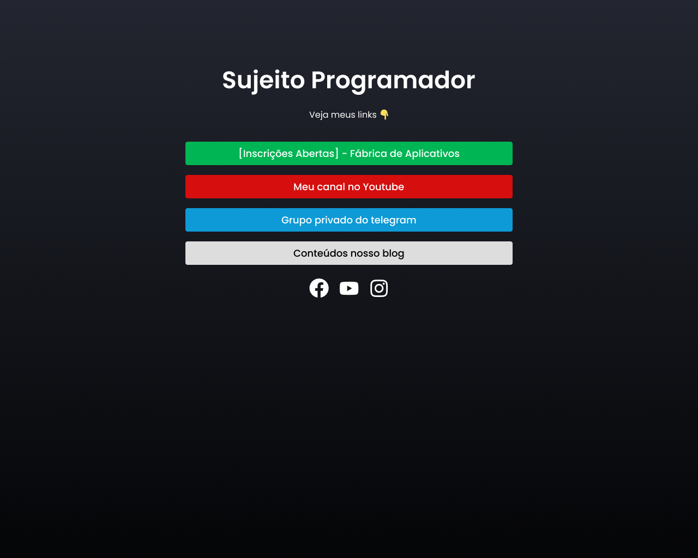
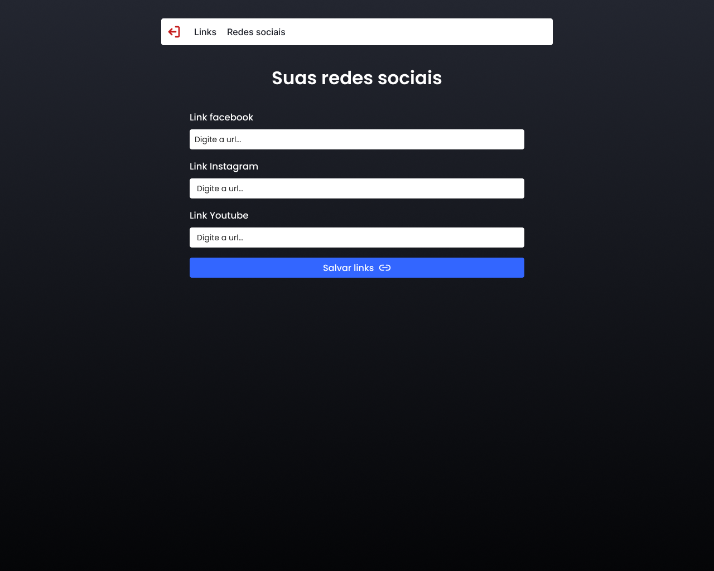
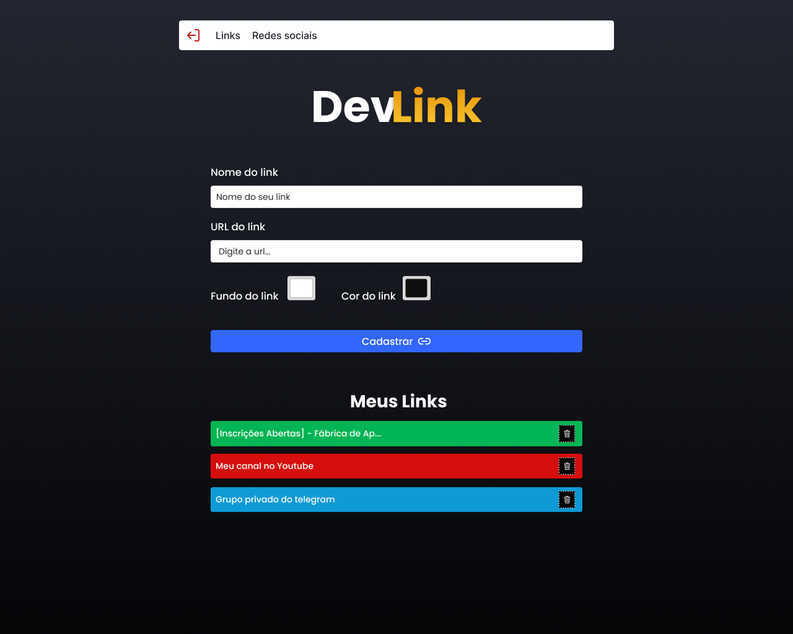
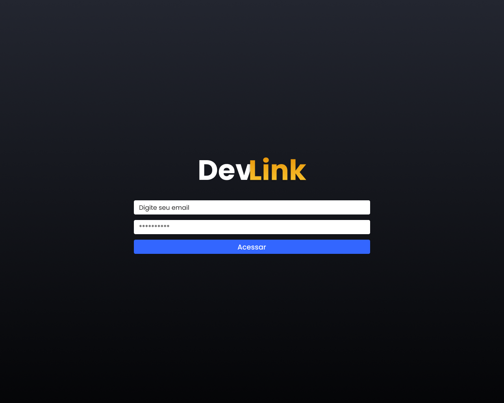
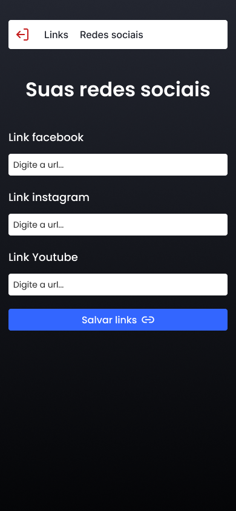
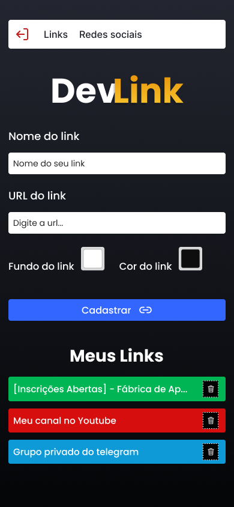
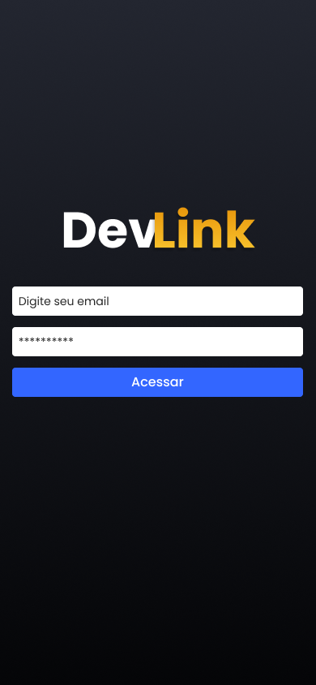

  

## 🟢 O que é?
### É um workshop realizado pelo Sujeito Programador (Matheus), nesse evento foi desenvolvido uma aplicação Web para criação e listagem de links.

## 🟢 Aulas:
- Iniciando sua jornada
- Evoluindo nossa aplicação
- Criando rota admin
- Dando vida ao projeto
- Próximo nível

## 🟢 Telas do Projeto:

  
Desktop

  

    
    
    
    
  

  
Mobile

  

    
    
    
    
  

